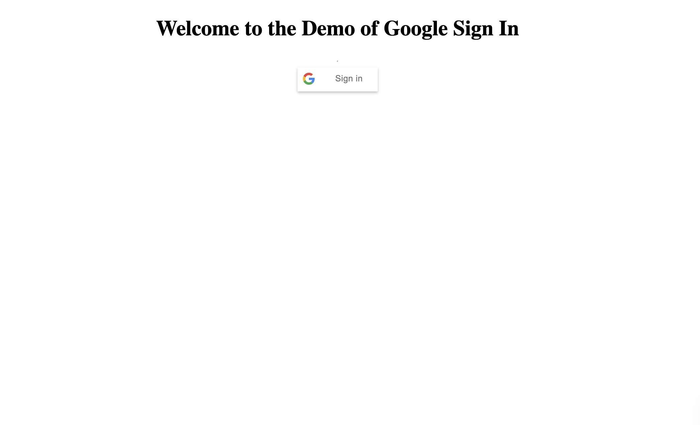

# Simple Google Sign-In
Create a simple HTML page which uses the Google Sign-In API to show a Sign In button like this:

When the user signs in with their Google account show the user name, photo and email address like this:

At this stage, if the user presses Refresh they should still be logged in.

Clicking the 'Sign Out' button should log the user out and show the sign in button again as shon in the first image above.  At this point pressing 
refresh should still show only a Sign In button
